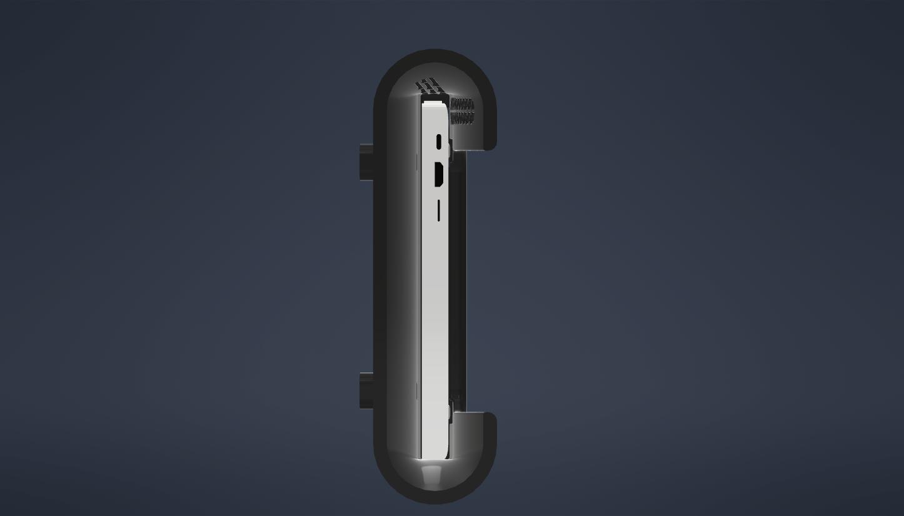

# Razer Book13 Dock

 
 

## Description
This is a 3D printable laptop dock for a Razer Book 13. This laptop dick essentially a sleeve that a Razer Book 13 laptop will slide into allowing it to connect to various IO. In this version of the dock, only 1 USB C/Thunderbolt 4 cable was used for power, display, USB devices, and networking. This cable was connected to the dock via epoxy and clamp. This clamp and the cutout in the dock for the for the cable, can be seen in Figures 1 and 2.  

Figure 1, Angle View of USB C Clamp

 

Figure 2, Straight View of USB C Clamp

 

 

The Razer Book 13 is inserted into the dock via a funneling mechanism incorparated into the shape of the dock. This funneling mechanism can be seen in Figure 3.

Figure 3, Funnel View of Laptop Dock

 

 

This laptop dock is composed 5 3D printable parts as seen in Figure 4 and the list below.
- 1x Upper Part → Funnel Part of the Dock
- 1x Bottom Part → Base Part of the Dock
- 2x Mount → Screw to a surface and contain dovetails to allow the upper and bottom parts to slide into the mounts
- 1x USB C Clamp → Clamp to secure the USB Cable once epoxied in place. 

Figure 4, All Parts

 

 

The upper and lower parts connect via printed snap clips. These two clips are unidirectional clips so once they are joined then can not be easily separated. The joined upper and bottom parts slide into the mounts and lock in place via unidirectional snap clips. To allow the dock to be removable, there are slots in the upper part where the snap clips on the mounts can be pushed out of the way to remove the joined upper and bottom part from the mounts. The USB C Clamp is connected to the bottom part via two heat set inserts and two 3mm screws. The bottom part has through holes for the 3mm screws, and channels for the heat set inserts on the top of these through holes.

 
 

## Printing Details

I printed these part on a modified Ender 3. The Toleances for the mates of these parts is about 0.2mm. 

I printed these parts with the follwing settings:
- material: Inland Black PETG
- layer height: 2.4mm
- Infill: Gyroid 10%
- Perimeters: 3
- Top solid layers: 7
- Bottom solid Layers: 7
- Supports: Where specified

 
 

## Slicing Details

### Upper Part

This part printed vertically with the funnel end down. No supports were added to this part.

 

### Bottom Part

This part was printed vertically with the closed end down. Supports were added to the overhang for the clamp and upper snaps.

 

### Mounts

This part was printed flat with the wall mount side down. To fit on the ender 3 this part rotated 45° along the z axis. Supports were added under the mount snaps.

 

### Clamp

The clamp was printed flat with the inside spiny texture pointing up.

 
 

## Cleanup 

These parts required very little clean asside from removing the supports. All supports were fully removed excexpt for the supports for the snaps on the bottom parts. These supports were sufficently removed to to prevent interferace but the rest of the supports were keep in place due to the small working area and somewhat fragile snap. A few other areas were filed down where need to allow for proper fits.

 
 

## Warnings

I made this dock for a friend and did not have the laptop on hand. I had to guess the position the ports on the laptop based on pictures I found on the internet. I refined the positon of the thunderbolt 4 port that was used based on printing test peices for the bottom. The rest of the ports on the given Razer Book 13 CAD model are likely in the wrong spot. 

The snaps between the upper and bottom parts can be fragile due to there printed orientaion. Due to their size and a few test prints I didn't have a problem with this. However, on the final print I did for this project one of the snaps broke. Upon removing the snap there is sufficient room to weld the parts together with a soldering iron and plastic from failed prints. 

 
 

## Software Details

3D CAD Software - Inventor 2021  
Slicing Software - Prusa Slicer
